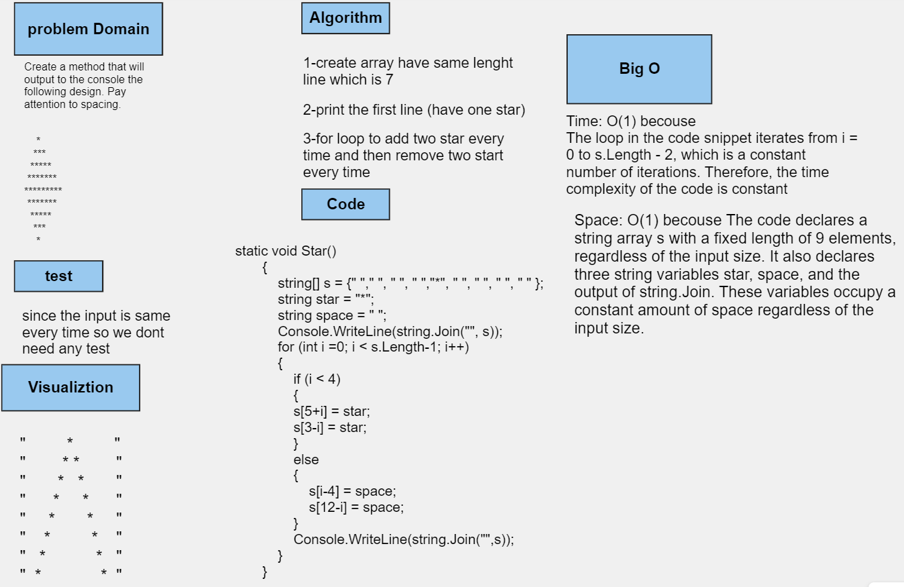

## Challenge 1

Write a program that asks the user for 3 numbers and returns the product of these 3 numbers multiplied together. If the user inputs less than 3 numbers, return 0. If the user inputs more than 3 numbers, only multiply the first 3. If a number is not a valid numeric value, default that value to 1.

**Example:**

Please enter 3 numbers: 4 8 15
The product of these 3 numbers is: 480

**Tests:**

- Input a string of numbers and verify that it returns the product of all numbers.
- Input more than 3 numbers and confirm that it only multiplies the first 3.
- Input less than 3 numbers and ensure that it returns 0.
- Test with negative numbers.

## Challenge 2

Create a method that asks the user to enter a number between 2 and 10. Then, prompt the user that number of times to enter random numbers. After the user has inputted all the numbers, find the average of the input numbers.

**Specifications:**

1. Do not allow the user to enter negative numbers.
2. Validate that each input is a real number.

**Example:**

Please enter a number between 2 and 10: 4

1 of 4 - Enter a number: 4
2 of 4 - Enter a number: 8
3 of 4 - Enter a number: 15
4 of 4 - Enter a number: 16

The average of these 4 numbers is: 10

**Tests:**

- Input different ranges of numbers and verify the calculated averages.
- Confirm proper validation of input.
- Test with all numbers being 0.

## Challenge 3

Create a method that outputs the following design to the console, paying attention to spacing:

    *
   ***
  *****
 *******
*********
 *******
  *****
   ***
    *

Tests:

No tests are required

## Challenge 4

Write a method that takes an integer array as input and returns the number that appears the most times. If there are no duplicates, return the first number in the array. If multiple numbers appear the same number of times, return the first found.

**Example:**

Input: [1, 1, 2, 2, 3, 3, 3, 1, 1, 5, 5, 6, 7, 8, 2, 1, 1]
Output: 1

**Tests:**

- Test with arrays of different sizes.
- Verify behavior when all numbers in the array are the same.
- Test with an array containing no duplicates.
- Test with multiple numbers appearing the same number of times.

## Challenge 5

Write a method that finds the maximum value in an unsorted integer array. You may not use the `.Sort()` method.

**Example:**

Input: [5, 25, 99, 123, 78, 96, 555, 108, 4]
Output: 555

**Tests:**

- Test with negative numbers.
- Test with all values being the same.

## Challenge 6

Write a method that asks the user to input a word and saves that word into an external file named `words.txt`.

**Hint:** Prepare a file named `words.txt` with a few words already present in the root directory.

*Stretch: Tests are optional for this challenge.*

## Challenge 7

Write a method that reads the file created in Challenge 6 and outputs its contents to the console.

*Stretch: Tests are optional for this challenge.*

## Challenge 8

Write a method that reads the file created in Challenge 6, removes one of the words, and rewrites it back to the file.

*Stretch: Tests are optional for this challenge.*

## Challenge 9

Write a method that asks the user to input a sentence and returns an array with each word and the number of characters in that word.

**Example:**

Input: "This is a sentence about important things"
Output: ["This: 4", "is: 2", "a: 1", "sentence: 8", "about: 5", "important: 9", "things: 6"]

**Tests:**

- Input a sentence and verify that it returns the correct array.
- Input a sentence and confirm that it returns an array.
- Test with different sentences containing various symbols.

